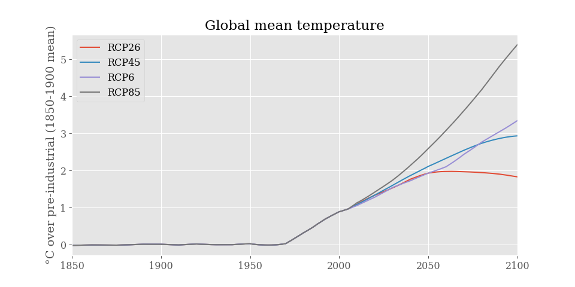

# pyhector

[](https://travis-ci.org/openclimatedata/pyhector)
[](https://pypi.python.org/pypi/pyhector)
[](https://pypi.python.org/pypi/pyhector)
[](http://mybinder.org/repo/openclimatedata/pyhector)

**pyhector** is a Python wrapper for the simple global climate
carbon-cycle model [Hector](https://github.com/JGCRI/hector).

**pyhector** makes the simple climate model Hector easily installable and usable
from Python and can for example be used in the analysis of mitigation scenarios
within integrated assessment models, complex climate model emulation, and
uncertainty analyses.

**[Hector](https://github.com/JGCRI/hector)** is written in C++ and developed at the
[Pacific Northwest National Laboratory](https://www.pnl.gov/).
The model description is published in

> Hartin, C. A., Patel, P., Schwarber, A., Link, R. P., and Bond-Lamberty, B. P.: A simple object-oriented and open-source model for scientific and policy analyses of the global climate system – Hector v1.0, Geosci. Model Dev., 8, 939-955, [doi:10.5194/gmd-8-939-2015](https://dx.doi.org/10.5194/gmd-8-939-2015), 2015.

See the Hector [repository](https://github.com/JGCRI/hector) and
[wiki](https://github.com/JGCRI/hector/wiki) for further information.

The Python interface **pyhector** is developed by [Sven Willner](http://www.pik-potsdam.de/~willner/)
and Robert Gieseke at the [Potsdam Institute for Climate Impact Research](https://www.pik-potsdam.de/).

It is currently based on a
[slightly modified Hector version](https://github.com/swillner/hector/) and
a [generic wrapper](https://github.com/swillner/hector-wrapper/) for Hector's API.
See the included git submodules for the specific commits that are being used.


## Usage

This repository also contains a Jupyter Notebook you can [try live](http://mybinder.org/repo/openclimatedata/pyhector), courtesy of the
[Binder](http://mybinder.org/) project ([Status](http://mybinder.org/status/)).

```python
import pyhector
from pyhector import rcp26, rcp45, rcp60, rcp85

import matplotlib.pyplot as plt

for rcp in [rcp26, rcp45, rcp60, rcp85]:
    output, params = pyhector.run(rcp, {"core": {"endDate": 2100}})
    temp = output["temperature.Tgav"]
    # Adjust to 1850 - 1900 reference period
    temp = temp.loc[1850:] - temp.loc[1850:1900].mean()
    temp.plot(label=rcp.name.split("_")[0])
plt.title("Global mean temperature")
plt.ylabel("°C over pre-industrial (1850-1900 mean)")
plt.legend(loc="best")
```




## Install

### Prerequisites

[Hector](https://github.com/JGCRI/hector)
requires [Boost](http://www.boost.org/), so to install and use
**pyhector** you need to have the filesystem and system modules
of *Boost* version 1.52 or later installed (see also the
[Hector build instructions](https://github.com/JGCRI/hector/wiki/BuildHector)).

On Ubuntu/Debian these can be installed by invoking
```bash
sudo apt-get install libboost-filesystem-dev libboost-system-dev
```

On macOS *Boost* is available through the Homebrew package manager:
```bash
brew install boost
```

### Install using pip

You can simply install **pyhector** from [PyPI](https://pypi.python.org/pypi/pyhector) by invoking
```bash
pip install pyhector
```


## Changelog

### 0.3.0

- default config object uses Python numbers or booleans instead
  of strings, units can be included as tuples like `(35.0, 'pptv')` and time
  series as lists of tuples like
  `'N2ON_emissions': [(1765, 11), (2000, 8), (2300, 8)]`

### 0.2.4

- first PyPI beta release


## Development

For local development you can clone the repository, update the
dependencies and install in a virtual environment with `pip`.

```bash
git clone https://github.com/openclimatedata/pyhector.git --recursive
cd pyhector
python3 -m venv venv
./venv/bin/pip install --editable .
```

To update **pyhector** and all submodules you can run
```bash
git pull --recurse-submodules
git submodule update --init --recursive
./venv/bin/pip install --editable .
```

Tests can be run locally with

```
python setup.py test
```
